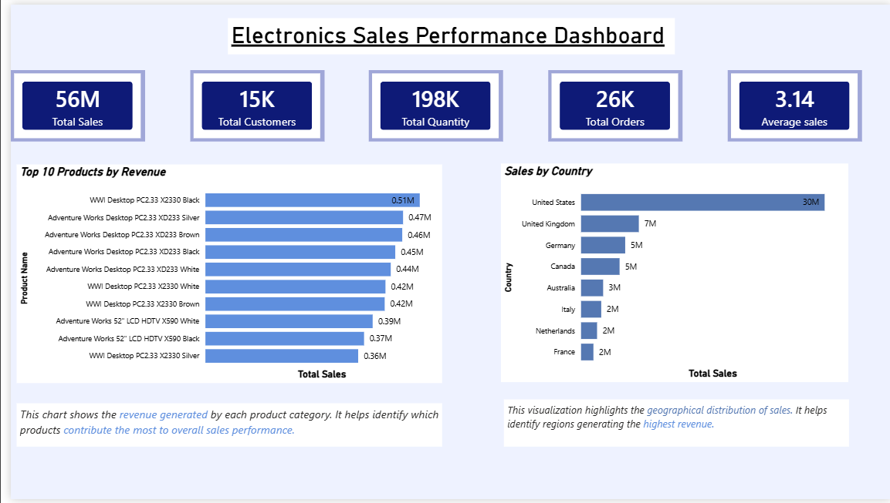
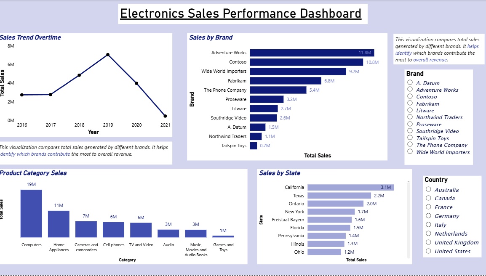

# 📊 Electronics Sales Performance Dashboard

## 📌 Project Overview

This project analyzes electronics sales data using Power BI to uncover revenue trends, customer behavior, and product performance. The goal is to support data-driven decision-making and identify business growth opportunities.

---

## 🛠 Tools Used

* Power BI

---

## 📊 Key KPIs

* Total Revenue
* Total Orders
* Total Customers
* Average Order Value
* Monthly Sales Trend

---

## 📈 Key Insights

* A small number of products contribute to the majority of total revenue
* Sales show clear seasonal trends with peak periods
* Certain regions consistently outperform others in revenue generation
* High-value customers contribute significantly to overall sales

---

## 💡 Business Recommendations

* Focus on high-performing products to maximize revenue
* Increase marketing efforts in low-performing regions
* Build strategies to retain high-value customers
* Plan inventory based on seasonal demand patterns

---

## 📸 Dashboard Preview

(Add your Power BI dashboard screenshots here)
## 📸 Dashboard Preview

## 📂 Files Included

* Power BI Dashboard (.pbix)

---

## 🚀 Conclusion

This dashboard provides clear and actionable insights into sales performance, enabling better strategic decisions and business growth.

